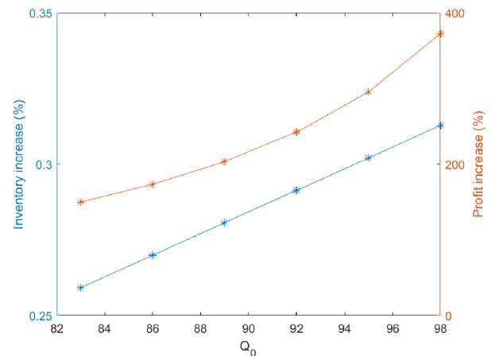
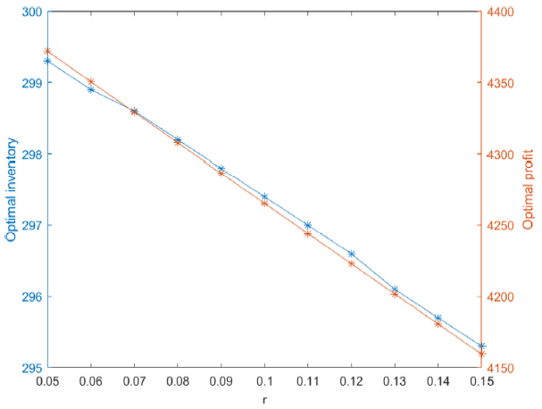
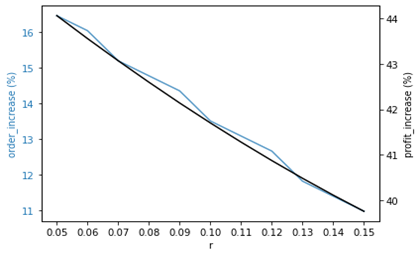
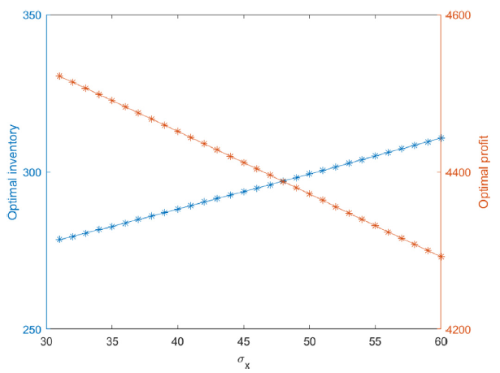
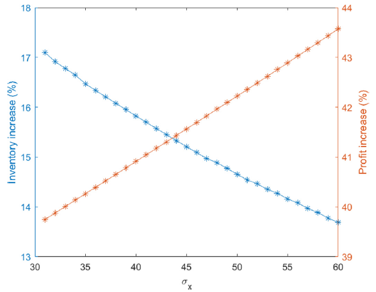
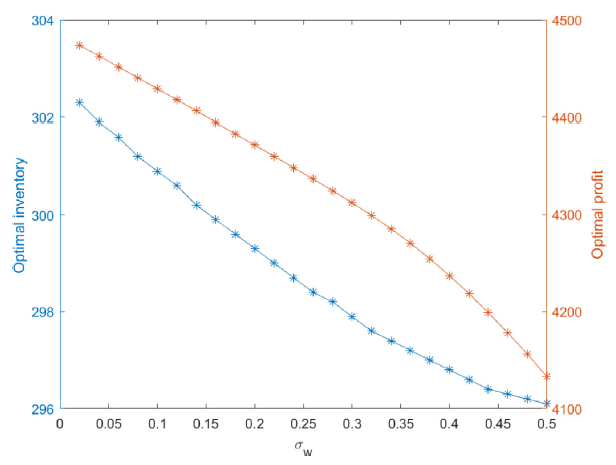
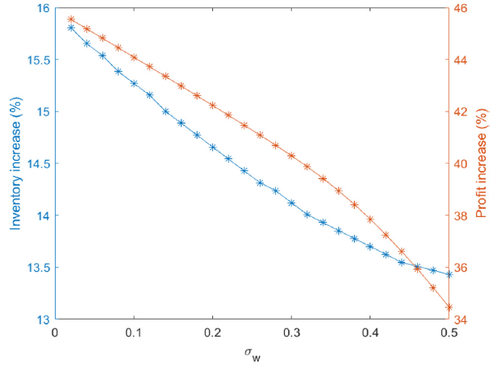

# Operations-Research-Applications-and-Implementation
## Tutorial of the newsvendor problem with barter exchange  

  
<b>Table of Contents</b>

  <ol>
    <li>
      <a href="#introduction">Introduction</a>
      <ul>
        <li><a href="#the-barter-exchange">The Barter Exchange</a></li>
    </li>
      </ul>
    <li>
      <a href="#model">The Model</a>
      <ul>
        <li><a href="#the-classical-newsvendor-model-with-consumption">The Classical Newsvendor Model with Consumption</a></li>
        <li><a href="#the-newsvendor-model-with-barter-exchange">The Newsvendor Model with Barter Exchange</a></li>
      </ul>
    </li>
    <li><a href="#visualization">Visualization</a></li>
    <li><a href="#conclusion">Conclusion</a></li>
  </ol>

# __Introduction__
This repository is a tutorial for the implementation of __The newsvendor problem with barter exchange__ based on the design of the paper _"The newsvendor problem with barter exchange"_  by [Hua, G., Zhang, Y., Chang, T.C.E, Wang, S., & Zhang, J. (2020)]("https://www.sciencedirect.com/science/article/abs/pii/S0925527313001837?via%3Dihub"). I wrote this tutorial as a showcase of application for the course "_Operations Research Applications and Implementation_" intructed by professor _Chia-Yen Lee_.  
## __The Barter Exchange__
> The barter exchange is an alternative to move distressed inventory, it has become increasingly popular in business. Many companies barter their unsold product for the product they need via barter exchange platforms at full prices.  
__There are two basic types of barter:__  
(1) Personal barter and retail barter  
(2) Commercial barter    
> We only focus on the __commercial barter__ in this tutorial  
> __The trade sequence is as follows:__  
> __Step 1:__  
> `Firm A` registers on a barter exchange platform and provides some essential information, the broker of the platform will help `Firm A` to find `Firm B` that exactly needs the product of `Firm A` and that provides the product that `Firm A` exactly needs.  
> __Step 2:__  
> `Firm A` and `Firm B` can trade their product `without money`, and pay the broker a commission  that typically is about `5% - 15%` of the trade value.  
> 
> __The aim of the barter is to maintain trade volumes and balance them while maximizing the utility of the participants.__  
# __The Model__
* We consider the `single-period` inventory (newsvendor) problem with barter exchange from the retailer's perspective, in which the customer's demand is `stochastic` and characterized by a `random variable`. The retailer determines the optimal stocking policy to satisfy the customer demand at the beginning of the selling season.  
* Suppose the retailer purchases only a single product A from the supplier, and the retail price is set by the supplier or the market. This problem is to decide the optimal order quantity to `maximize its own expected profit`.  
* The retailer orders `Q units of the product A` from the supplier at a `fixed price` at the beginning of the selling season, then it sells product A to its customers at the `retail price`.  
* There are three cases of the retailer's profit:  
(1) If customer demand is `greater than` Q, then it will pay `the shortage penalty cost` for the unsatisfied demand  
(2) If customer demand is `less than` Q, the retailer will trade the unsold product A for the product it needs on a barter platform  
(3) If there are still some `unsold product A` after barter exchange, the retailer will dispose of them at a very low price  
 *  The notation used in this tutorial is as follows:    
<table>
  <tr>
    <td>Notation</td>
    <td>Description</td>
  </tr>
  <tr>
    <td>x</td>
    <td>Stochastic demand, a random variable</td>
  </tr>
  <tr>
    <td>f(x)</td>
    <td>The probability density function of x</td>
  </tr>
  <tr>
    <td>F(x)</td>
    <td>The cumulative distribution function of x</td>
  </tr>
  <tr>
    <td>c</td>
    <td>The supplier's wholesale price</td>
  </tr>
  <tr>
    <td>p</td>
    <td>The retailing price per unit (p > c)</td>
  </tr>
  <tr>
    <td>v</td>
    <td>The salvage value per unit (v < c)</td>
  </tr>
  <tr>
    <td>s</td>
    <td>The shortage penalty cost per unit</td>
  </tr>
  <tr>
    <td>Q</td>
    <td>The order quantity, a decision variable</td>
  </tr>
  <tr>
    <td>Q_0</td>
    <td>The value of the product the retailer needs on the barter platform is equal to the value of Q0 units of the product that the retailer sells</td>
  </tr>
  <tr>
    <td>Q_c*</td>
    <td>The optimal order quantity in the classical newsvendor model</td>
  </tr>
  <tr>
    <td>Q*</td>
    <td>The optimal order quantity in the newsvendor model with barter</td>
  </tr>
  <tr>
    <td>r</td>
    <td>The retailer pays r percent of retail price to the barter platform as the commission of per unit product</td>
  </tr>
  <tr>
    <td>π(Q,x)</td>
    <td>The total profit if the order size is Q units and the customer demand is x</td>
  </tr>
</table>

## __The Classical Newsvendor Model with Consumption__  
In this section, we incorporate the retailer's consumption into the model.  
The __retailer's profit per period__ is  

  

The __retailer's expected profit__ is  

  

The __retailer's optimal order quantity__ satisfies the following equation:  
## __The Newsvendor Model with Barter Exchange__  
In this part, we are going to discuss the retailer's profits for the following three cases:  
__Case 1.__ Q≤x (The retailer's order quantity Q is less than the customer demand x), the retailer pays `the shortage penalty cost s` for `the unsatisfied demand`  
The retailer's profit π(Q,x) = (p-c)Q-s(x-Q)-pQ_0  
__Case 2.__ x<Q≤x+Q_0  
# __Visualization__  
We conduct the __sensitivity analysis__ to examine the `demand uncertainty` and `barter uncertainty` on the newsvendor's decisions and profit. Taking the first derivative of `r` and `Q_0` in __Theorem 1__, the retailer's order quantity and profit `decreases` with barter commission, while the order quantity `increase`s and profit `decreases` with the value of the product that the retailer will buy. In addition, the profitability of barter `increases` with barter commission and `decreases` with the value of the product that the retailer will buy. The following are the sensitivity analyses of `demand uncertainty` and `barter uncertainty`.  
__1. Demand uncertainty__  
As we can see in the figures, with `the increasing value of Q_0`, the retailer's order quantity `increases` while the profit `decreases` (Fig. 1), and the increment rates also increase (Fig. 2). The `decreasing commission` will cause the retailer's order quantity and profit `increase` (Fig. 3), and their increment rates also increase (Fig. 4). From the demand perspective, with the increasing value of demand variance, the retailer's order quantity `increases` while the profit `decreases` (Fig. 5). Besides, the increment rate of inventory is `decreasing` while the increment rate of profit increasing with demand uncertainty (Fig. 6), which indicates __barter can effectively cope with variance in demand__.    
__2. Barter uncertainty__  
Different from the effect of demand uncertainty, with increasing barter supply uncertainty, both the retailer's order quantity and profit decrease (Fig. 7). The increment rates of inventory and profit are decreasing, which indicates barter uncertainty will dampen the profitability of barter (Fig. 8). Consequently, __the retailer should decrease inventory when barter uncertainty becomes larger__.

  
  
<b>Fig. 1.</b> Impact of Q_0 on the optimal inventory and profit

  
  
<b>Fig. 2.</b> Impact of Q_0 on inventory and profit increase

  
  
<b>Fig. 3.</b> Impact of the commission on optimal inventory and profit

  
  
<b>Fig. 4.</b> Impact of the commission on the inventory and profit increase

  
  
<b>Fig. 5.</b> Impact of demand uncertainty on the optimal inventory and profit

  
  
<b>Fig. 6.</b> Impact of demand uncertainty on inventory and profit increase

  
  
<b>Fig. 7.</b> Impact of barter uncertainty on the optimal inventory and profit

  
  
<b>Fig. 8.</b> Impact of barter uncertainty on inventory and profit increase

